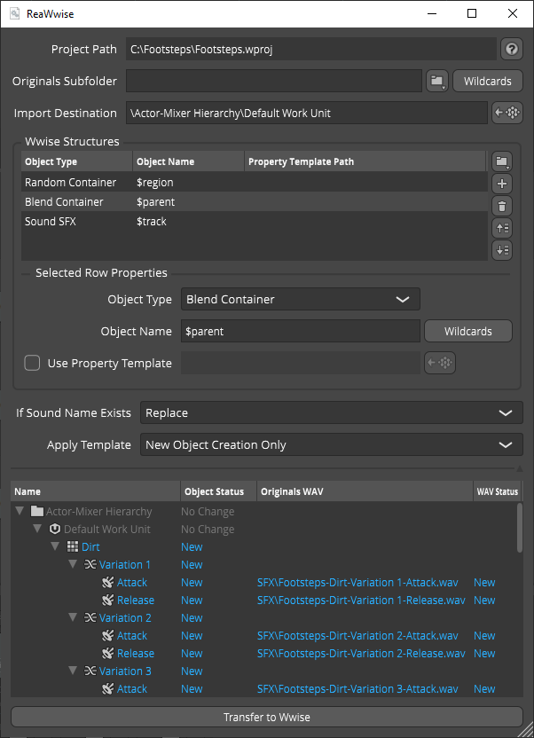

# ReaWwise

ReaWwise is a REAPER extension that sound designers can use to transfer audio files from REAPER into Wwise projects. The transfer process creates Wwise objects in manually defined hierarchies, so that Wwise users can start working with the imported sounds immediately. ReaWwise supports all REAPER wildcards and is available through the ReaPack package manager and the [releases page](https://github.com/audiokinetic/ReaWwise/releases) of this repository.



## Table of contents

- [**Getting Started**](#getting-started)
- [Building from Source](#building-from-source)
- [Contributing](#contributing)
- [Legal](#legal)
- [Acknowledgments](#acknowledgements)

## Getting Started

### Supported Platforms
- Windows
- Mac

### Manual installation
1. Go to the the [releases page](https://github.com/audiokinetic/ReaWwise/releases), then download the extension file (reaper_reawwise.dll for Windows or reaper_reawwise.dylib for Mac).

2. Copy the extension to the REAPER [UserPlugins directory](#userplugins-directory).

3. If REAPER is running, restart the application. The extension is available in the Extensions menu.

### Installing ReaWwise through ReaPack
1. In the REAPER menu, go to **Extensions** > **ReaPack** > **Browse Packages**. A dialog opens, and displays a list of packages available for installation.

2. Right-click on the ReaWwise package and select the version you want to install.

3. Click **Apply** in the bottom-right corner of the dialog. The ReaWwise package is downloaded and moved to the UserPlugins directory.

4. After the plugin installation is complete, restart REAPER. The extension is now available in the **Extensions** menu.

## Building from Source

### Requirements
- Git
- CMake (minimum version 3.22.0)
- Platform-specific build tools (Visual Studio or XCode)
- Wwise with SDK (minimum version 2021.1.1)
- WWISESDK environment variable set to the path of the installed Wwise SDK

### Building
```cmd
git clone https://github.com/audiokinetic/ReaWwise.git
cd ReaWwise
git submodule update --init
cmake -B build
cmake --build build --target ReaWwise --config Release
```
After the binary is built, move it to the REAPER [UserPlugins directory](#userplugins-directory). If REAPER is open, restart the application. The extension is available in the **Extensions** menu.

## Basic Usage
1. Open your REAPER and Wwise projects.
2. Configure your REAPER render settings appropriately. The render settings determine which files will be transferred to Wwise.
3. Open ReaWwise and configure settings such as the Originals Subfolder (optional), Import Destination, Wwise Structures, and so on.
4. Preview the audio files and Wwise objects to be transfered in the Preview Panel.
4. Click **Transfer To Wwise** to transfer the audio files and create the corresponding Wwise objects.

## UserPlugins Directory
- Windows:  %appdata%\REAPER\UserPlugins
- Mac: ~/Library/Application Support/REAPER/UserPlugins

## Other Resources
Refer to the [ReaWwise User Guide](https://audiokinetic.com/library/reawwise) for more information regarding usage, installation and troubleshooting of the extension.

For general questions about usage, refer to Audiokinetic's [Community Q&A](https://www.audiokinetic.com/qa/ask).

## Contributing
The repository is not open to pull request but in the case of a bug report, bugfix or a suggestions, please feel free to [open an issue](https://github.com/audiokinetic/ReaWwise/issues).

Feature requests can also be submitted to the [feature request section](https://www.audiokinetic.com/qa/feature-requests/) of Audiokinetic's Community Q&A. Use ReaWwise as the Category when submitting a question.

## Legal
Copyright © 2020 [Audiokinetic Inc.](https://audiokinetic.com) All rights reserved.

## Acknowledgements
Inspired by the work of [Karl Davis](https://github.com/karltechno)